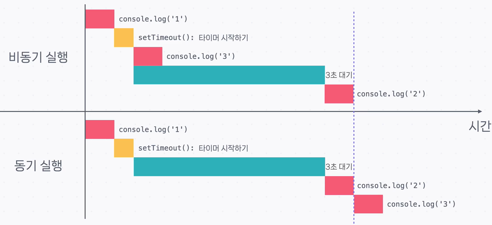

# 비동기 함수와 `setTimeout`

---

## `setTimeout`

- **`setTimeout`**은 **특정 시간이 지난 다음에 어떤 함수를 실행**해 주는 함수입니다.
- 비동기 프로그래밍에서 자주 사용됩니다.

---

## 비동기 함수란?

- **비동기 함수**는 **함수의 내용을 끝까지 한 번에 실행하지 않고**,  
  중간에 다른 작업을 처리하다가 다시 돌아와 마무리하는 함수입니다.

---

## 자바스크립트의 비동기 함수

- **자바스크립트와 자바스크립트 라이브러리**는 다양한 비동기 함수를 제공합니다.
- 비동기 함수에 **콜백**을 넘겨주는 것만으로 비동기 프로그램을 구현할 수 있습니다.
